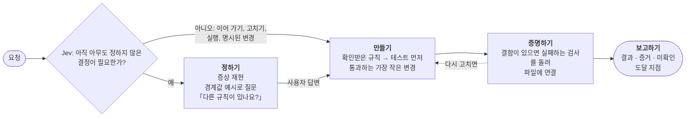
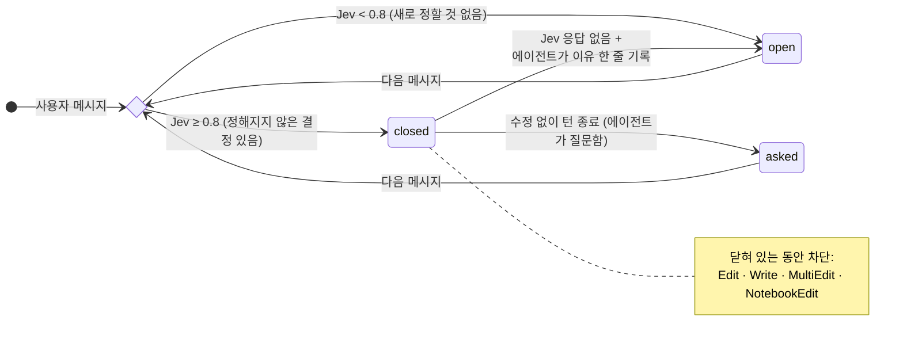
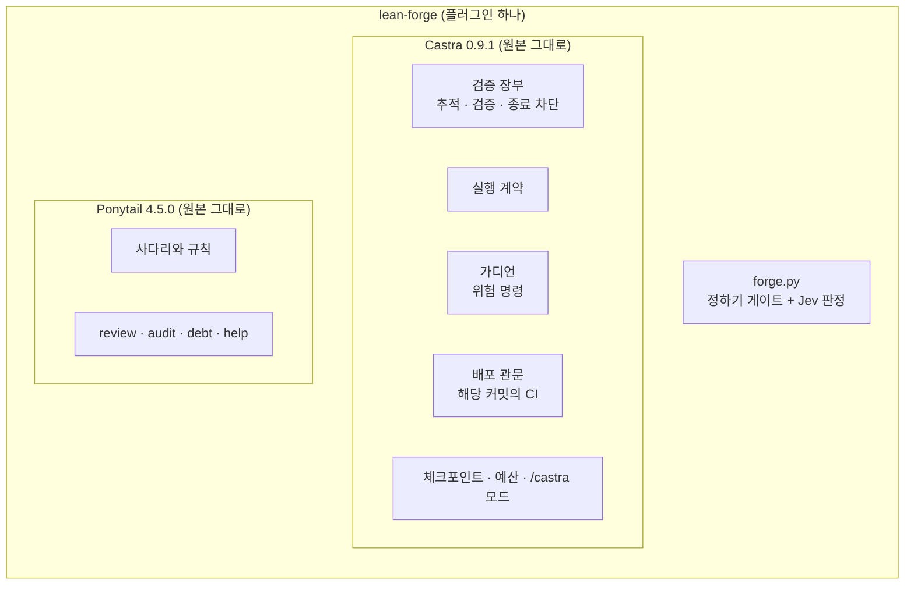

# lean-forge

**중요한 것은 묻고, 코드는 최소로, 끝은 증거로.**

결과를 가르는 결정을 파일에 손대기 전에 확정하고, 그 결정을 만족하는 가장 작은 코드를 만들고, 모든 수정을
증거로 닫는 Claude Code 플러그인입니다. [Castra](https://github.com/beyondworks/castra)와
[Ponytail](https://github.com/DietrichGebert/ponytail)을 통째로 안에 담았고, 훅으로 강제하는 질문 단계를
더했습니다. 따로 설치할 것도, 어느 쪽을 켤지 고를 것도 없습니다.

[English](README.md)

---

## 발상

코딩 에이전트는 정반대의 두 방향으로 실패합니다.

- **빠른 하네스는 짐작합니다.** 멈추지 말라는 지시를 받은 에이전트는 열린 질문을 그럴듯한 기본값으로 채웁니다.
  회계 담당자가 요청한 적 없는 영어 CSV 머리글을 달고, 아무도 승인하지 않은 송장 번호 형식을 정하고,
  사용자의 틀린 짐작(「아마 `round()` 탓일 거야」)을 원인으로 받아들입니다.
- **꼼꼼한 하네스는 절차에 비용을 씁니다.** 필요한 질문을 정확히 합니다. 그런 다음 대부분의 시간을 계약 문서,
  검수 서브에이전트, 가지를 만들고 커밋하는 절차에 씁니다.

정확도는 뒤따르는 절차가 아니라 처음 몇 분 안에 하는 질문에서 나옵니다. 빠른 하네스가 빠른 이유는 묻지 않기
때문입니다.

lean-forge는 질문은 남기고 절차는 뺐습니다. 그리고 질문이 사라지지 않도록 프롬프트에 기대지 않습니다. 결과를
가르는 결정이 확정될 때까지 훅이 파일 수정을 막습니다. 규칙을 글로만 적었을 때는 10번 중 4번 지켜졌고, 훅으로
막자 매번 지켜졌습니다.

---

## 모든 요청이 거치는 하나의 흐름



| 단계 | 하는 일 | 강제 방법 |
|---|---|---|
| **정하기** | 사용자가 짐작한 원인은 가설로 보고 재현합니다. 결과가 답해야 할 결정을 구조·동작·계약·기술 관점으로 나열합니다. 한 번에, 최대 다섯 가지를, 추천안과 경계값 예시를 붙여 묻고, 끝에 「이 밖에 정해 둔 규칙이 있나요?」를 붙입니다 | 사용자가 답할 때까지 수정을 막습니다. 독립 판정기(Jev)가 에이전트의 직전 답변까지 함께 읽고, 사용자에게 보이는 것 중 새로 정할 것이 없으면 바로 엽니다(계획을 이어 가거나 승인할 때, 보고된 문제를 고칠 때, 실행할 때, 변경 내용이 명시되어 있을 때) |
| **만들기** | 확인받은 규칙마다 이유 한 줄을 달아 수용 테스트로 먼저 만듭니다. 그다음 Ponytail 사다리를 따릅니다(필요한가 → 표준 라이브러리 → 플랫폼 기능 → 설치된 의존성 → 한 줄 → 최소 코드) | 세션마다 주입되는 Ponytail 규칙 |
| **증명하기** | 고친 파일은 검사가 명시적으로 연결될 때까지 미검증으로 기록됩니다. 다시 고치면 증거가 무효가 됩니다 | Castra 검증 장부: 미검증 파일이 남은 채 턴을 끝내면 막습니다 |
| **보고하기** | 바뀐 것, 결정적인 증거, 확인하지 못한 것, 그리고 변경이 도달한 곳(소스, 설치본, 실행 중인 서비스, 운영)을 적습니다 | Castra 실행 계약 |

질문은 정하기 단계에서만 합니다. 만들기부터는 멈추지 않습니다. 서로 부딪히던 두 속도 규칙(「멈추지 말라」와
「먼저 물어라」)이 서로 다른 단계로 나뉘었습니다.

---

## 정하기를 강제하는 방법



판정기는 [Jev](https://docs.typesafe.ai)입니다. 글 대신 확률을 돌려주는 작은 모델이고, 한 번 판정에 0.7초 안팎이
걸립니다. 사용자 메시지가 올 때마다 그 메시지와 에이전트의 직전 답변을 받아 질문 하나에 답합니다. *이 일을 하려면,
아직 아무것도 정해 주지 않은 것 중 사용자가 보거나 기대게 될 것을 에이전트가 골라야 하는가?* 키가 없거나 Jev가
응답하지 않으면, 질문한 턴 뒤에 온 메시지를 그 답으로 보고, 기계적 작업은 에이전트가 이유를 한 줄 남겨야 열립니다.

v2.0.4까지는 메시지 하나만 보고 *요청이 결과를 글자 그대로 정해 주는가*를 물었습니다. 작업하던 턴 뒤의 「진행해줘」
같은 짧은 승인은 결과를 정해 주지 않으므로, 합의한 작업 도중에 수정이 막혔습니다. 만든 사람이 실제로 보낸
메시지(세션 298개, 4,534건)로 잰 결과입니다.

| 새로 뽑은 표본 100건 (기준값은 다른 100건으로 정함) | 잘못 닫음 | 잘못 엶 |
|---|---|---|
| v2.0.4 규칙, 작업하던 턴 뒤 | 42건 중 42건 | 5건 중 0건 |
| **v2.0.5 규칙** | **42건 중 1건** | **5건 중 0건** |

나머지는 질문과 확인 요청이라 어느 쪽으로 판정해도 문제가 없습니다.

**내 지시 습관 (선택).** `~/.config/lean-forge/profile.txt`가 있으면 게이트가 읽습니다. 에이전트에게 지시하는
습관(자주 쓰는 승인 표현, 늘 따르는 절차)을 짧게 적은 일반 텍스트입니다. 판정할 때마다 Jev에만 함께 보내고, 다른
곳으로는 보내지 않습니다. 저장소에는 넣지 마세요. 없어도 게이트는 동작하며, 만든 사람의 자료에서는 보정용 표본의
잘못 닫음 5건 중 3건을 없앴습니다.

---

## 안에 들어 있는 것



| 구성 | 원본에서 가져온 것 | 바꾼 것 |
|---|---|---|
| Castra | 전부: 파일 단위 검증 장부, 실행 계약, 가디언(강제 푸시·`DROP`·`.env` 읽기는 사용자에게 넘기고, `rm -rf`·`reset --hard`·`sudo`·배포는 먼저 확인), 배포 관문, 체크포인트, 예산 경고, `/castra` 모드 | 없음 |
| Ponytail | 전부: 사다리, 규칙, `/ponytail lite\|full\|ultra`, 스킬 4개 | 한 문장: 「게으른 버전을 먼저 내고 되묻고, 멈추지 말라」가 이제 정하기 **이후**에만 적용됩니다 |

---

## 결과

작은 파이썬 송장 라이브러리에서 과제 8개, 숨긴 테스트 36개로 쟀습니다. 모든 하네스에 같은 의도 파일로 답하는
사용자 역할 시뮬레이터(Claude Sonnet)를 붙였습니다. 에이전트 모델은 모두 Claude Opus 5이고, 비용은 사용한 토큰을
API 가격으로 환산한 값입니다.

**다른 하네스를 켜지 않은 상태**

| 하네스 | 숨긴 테스트 통과 | 시간 | 비용 |
|---|---|---|---|
| Castra + Ponytail | 15/36 | 10분 | $3.79 |
| **lean-forge** (2회) | **31/36 · 36/36** | **18분** | **$5.2** |

**차이가 진짜인가?** 한 과제의 숨긴 테스트들은 서로 독립이 아니므로 과제를 한 묶음으로 보고, 과제별 짝 차이의
평균과 95% 신뢰구간, 부호 검정을 계산했습니다([Miller 2024](https://arxiv.org/abs/2411.00640)의 권고).

| lean-forge − Castra + Ponytail (과제 8개) | 차이 | 95% 신뢰구간 | 부호 검정 |
|---|---|---|---|
| 과제 통과율 (0.94 vs 0.47) | **+0.46** | +0.17 ~ +0.76 | p = 0.031 |
| 숨긴 테스트 전부 통과한 비율 (0.94 vs 0.25) | **+0.69** | +0.30 ~ +1.07 | p = 0.031 |
| 과제당 시간 (2.3분 vs 1.2분) | +1.1분 | +0.5 ~ +1.6 | p = 0.070 |
| 과제당 비용 ($0.65 vs $0.47) | +$0.18 | +0.05 ~ +0.31 | p = 0.070 |

정답률은 분명히 높고, 그 대가로 과제당 약 1분과 $0.18을 더 씁니다.

다른 플러그인·훅·메모리가 모두 켜진 작성자의 개인 설정(과제 7개)에서도 방향은 같았습니다(과제 통과율 0.96 vs 0.57,
차이 +0.39, 95% −0.05 ~ +0.82). 다만 이 규모에서는 통계적으로 확정되지 않습니다. 시간과 비용은 차이가 없었습니다.

Claude Opus 5.5(Claude Code 2.1.280, effort medium, 과제당 3회)에서는 하네스 없이 0.75, lean-forge를 켜면 0.97이었습니다
(차이 +0.23, 95% −0.04 ~ +0.49).

*v2.0.3까지의 README는 숨긴 테스트 36개를 서로 독립인 것처럼 합쳐 피셔 검정을 해서 「p < 0.001」로 적었습니다. 이 방식은
유의성을 과장합니다. v2.0.4에서 위 방식으로 바로잡았습니다.*

- lean-forge가 놓친 테스트 8개 중 6개는, 시뮬레이터가 자기 의도 파일과 다르게 답한 두 회차에서 나왔습니다(틀린
  번호 형식을 승인했고, 의도 파일에 답이 있는 질문을 「알아서 하라」고 넘겼습니다). 두 번 모두 에이전트는 맞는
  질문을 했습니다. 나머지 2개는 모든 하네스가 한 번 이상 틀린 반올림 경계값 하나입니다.
- lean-forge가 고친 파일은 모두 Castra 장부에서 *verified*로 끝났고, 종료 차단은 한 번도 걸리지 않았습니다
  (30회 중 0회. Castra + Ponytail은 8회 중 7회 걸렸습니다).

다시 돌리는 데 필요한 것은 모두 [`bench/`](bench/)에 있습니다. 과제, 의도 파일, 숨긴 테스트, 원본 저장소,
실행기, 회차별 수치([`bench/results-summary.csv`](bench/results-summary.csv))입니다.

```bash
cd bench
python3 run.py G t1 1          # lean-forge로 과제 t1을 1회차 실행
python3 significance.py        # 기록된 결과와 비교
```

---

## 설치

```text
/plugin marketplace add beyondworks/lean-forge
/plugin install lean-forge@lean-forge
```

필요한 것: `python3`, `node`, `git`. 선택 사항으로 Jev용 TypeSafe 키가 있습니다. 환경 변수 `TYPESAFE_API_KEY`로
주거나, 같은 이름의 macOS 키체인 항목으로 두면 됩니다.

이미 `settings.json`에 Castra 훅을 켜 두었거나 Ponytail 플러그인을 쓰고 있다면 끄세요. lean-forge 안에 둘 다
들어 있어서, 같이 켜면 같은 훅이 두 번 돕니다.

## 사용

따로 부를 것은 없습니다. 평소처럼 요청하면 됩니다.

- 결과가 요청에 다 적혀 있으면 바로 처리합니다. 에이전트가 제안한 계획을 이어 가라거나 승인하거나 고쳐 달라는
  메시지도 마찬가지입니다.
- 그렇지 않으면 먼저 질문 메시지가 하나 옵니다. 답하면 멈추지 않고 이어서 끝냅니다.
- `/castra review · verify · reframe · finish · resume · status`와 `/ponytail lite | full | ultra`는 원본과
  똑같이 동작합니다.

자체 검사:

```bash
python3 hooks/test_forge.py    # 정하기 게이트 (Jev 사용 / 미사용)
python3 hooks/test_bundle.py   # 가디언, 배포 관문, 세션 계약, 검증 장부, Ponytail
```

---

## 한계

- 작은 저장소 하나에 과제 8개이고, 기존 하네스는 과제마다 1회씩 돌렸습니다. 큰 코드베이스, 여러 모듈에 걸친
  변경, 실제 화면이나 설치본에서의 검증은 벤치에 없었습니다. 가디언·배포 관문·검증 장부는 대신
  `hooks/test_bundle.py`로 검사합니다.
- 사용자 역할 시뮬레이터도 모델이라 틀립니다(위 참고).
- 정하기 게이트는 수정 도구만 봅니다. 셸로 파일을 쓰면 지나갑니다. Castra 장부도 같습니다.
- Jev 기준값(0.8)은 한 사람의 메시지로 정했습니다(보정 100건, 검증 100건). 자기 사용 기록으로 다시 맞추세요.

## 출처

- [Castra](https://github.com/beyondworks/castra) 0.9.1 — MIT, 가디언의 판정만 좁혀 포함: 규칙은 명령이 실제로 실행하는 부분에만 적용하고 데이터(파일에 쓰는 here-document 본문, 검색어, 주석) 속 글자에는 적용하지 않습니다. `git -C …`로 하위 명령이 가려지지도 않습니다 ([라이선스](vendor-licenses/castra-LICENSE))
- [Ponytail](https://github.com/DietrichGebert/ponytail) 4.5.0, Dietrich Gebert — MIT, 한 문장만 바꿔 포함 ([라이선스](vendor-licenses/ponytail-LICENSE))
- [Jev](https://docs.typesafe.ai), TypeSafe — 외부 API

MIT © beyondworks
